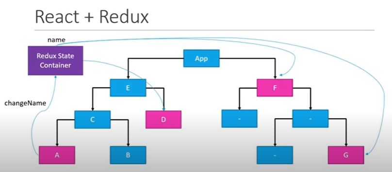
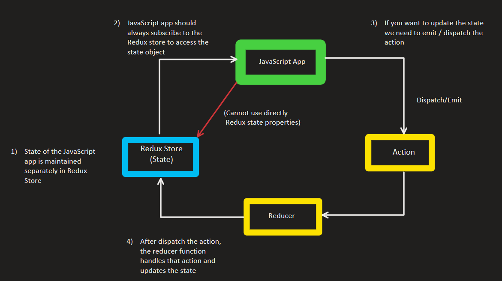

#  `React-Redux`

    -   React-Redux is the offical Redux UI libray for React


*   __`React is library used t build user interfaces`__
*   __`Redux is a library for managing state in a predictable way in JavaScript applications.`__
*   __`React -Redux is a library that provides bindings to use React and Redux together in an application.`__


### `Perrequisites`

*   Fundamentals of React.
*   React Repository path for beginners on my Git  [Click hear](https://github.com/PrasanthReddy-Chittapu6683/ReactJs-V16.13.1/tree/master/reactjs-my-learnings) -> Goto reactJs.txt material file to better understanding from scratch. 


## `What is Redux`

*   __`Reduc is a predictable state container for JavaScript apps`__
*   Redux is for Javascript application.
    *   Redux can be used for React, Angular, Vue and even with Vanilla JavaScript.
    *   Redux is a library for JavaScript applications.    
*   Redux is a state container
    *   Redux sotres the state of your application.
    *   `state of an application` means state represented by all individual components of that application.
        *    Ex: 
            LoginFormComponent:
            ``` json
                state = {
                    userName: '',
                    password: '',
                    submitting:false
                }
            ```
            UserListComponent:
            ``` json
                state = {
                    users : []
                }
            ```
*   Redux is predictable
    *   Redux is a state container, In any Java script application state can change.
        Ex:  In todo list application - item status:(pending) -> item status:(completed)
    *   In Redux, all state transitions are explicit and it is possible to keep track of them 
    *   The changes in your application's state become predictable.
    *   Redux wil store and manage the application state.
*   To manage the state of your application in a predicable way, redux can help.

## `Why Redux in React?`

*   Already we have components in React having their own state. Question is why we need another tool to manage the state?
*   Consider an application with several components and nested componentes. 
    *   Suppose if we need textbox that use can enter `user name` in Component A .
    *   Now, Sibling Component B needs to use `user name`. In react will do this by lifting the Component state to Component C.
    *   Now data can be managed in the Parent Component C then provide the data, methods and varibale as `props`  to Component A and B.
    *   What if we need to display in other Child Component of the other Parent Component and so on.. we just need to lifting the state to higher Components.
    *   This is not that easy to make changes eveytime.
    *   In React apppliction, if we have large no of components and want to share the state or data to other components, state management could become trouble. This where __`REDUX`__ helps out.
    *   Using Redux, your state is contains outside the Components. If Component A want to update the update the state, it communicates with Redux state container.
    *   Using this seperate Redux State container only the respective components get data from Redux State.
        


### `Setup the project`

*   Go to project folder path in Terminal, enter the commmand
    *   __`npm init --yes`__ This will create a `package.json` file with settings
        ```json
            {
                "name": "ReactRedux",
                "version": "1.0.0",
                "description": "",
                "main": "index.js",
                "scripts": {
                    "test": "echo \"Error: no test specified\" && exit 1"
                },
                "repository": {
                    "type": "git",
                    "url": "git+https://github.com/PrasanthReddy-Chittapu6683/ReactRedux.git"
                },
                "keywords": [],
                "author": "",
                "license": "ISC",
                "bugs": {
                    "url": "https://github.com/PrasanthReddy-Chittapu6683/ReactRedux/issues"
                },
                "homepage": "https://github.com/PrasanthReddy-Chittapu6683/ReactRedux#readme"
            }
        ``` 
*   Now add  `Redux` as a dependency for our project. Run the command in terminal
    *   __`npm install redux`__  once it is completed we can see the dependency added to packag.json
        ```json
            "dependencies": {
                "redux": "^4.0.5"
            }
        ```
*   Lets create javscript file to write our code. __`index.js`__
    *   Just print `console.log("From index.js")` and run command __`node index`__ . This will print the log statement in terminal.
        

### `Concepts in Redux`

*   In Redux we have mainly need to know about 3 concepts
    *   __`Store`__ : It Holds the state of your application (It will have your model object details)
    *   __`action`__ : It describes the changes in the state of the application (ie., Button click or dropdown change or any custom identification)
    *   __`reducer`__ : Which actually carries out the state transistion depending on the action. (Ties the store and actions together)  

*   Lets see how we can use this concepts

1.  __`The state of your whole application is stored in an object tree within a single store`__
    *   Maintain our application state in a single object which would be managed by Redux store.
2.  __`The only way to change the state is emit an action, an object describing what happened`__
    *   To update the state of your app, you need to let Redux know about that with an action.
    *   Not allowed to update directly to the state object.
3.  __`To specify how the state tree is transformed by actions, you write pure reducers`__
    *   In the 2nd principle `state` can only be transformed / changed by emit an actions. Using the reducer we can transform/change the state properties. For this we need to write pure reducer to determine how the state chagnes.
    *   Pure Reducers are pure functions that takes previous state  and action as an input and then transforms the state properties and return new State.
    *   Reducer - (previousState, action) => newState 
    *   Ex:
    ```Javascript
        const reducer =(state,action) => {
            switch(action.type) {
                case BUY_CAKE:
                    return {
                        numofCake: state.numofCake - 1
                    }
                case PREPAREL_CAKE:
                    return {
                        numofCake: state.numofCake + 1
                    }
            }
        }
    ```   
    
    
### `Actions`

*   Actions are the only way we can communicate with our application and Store.
*   Carry some information from application to the Redux store.
*   These are plain Javascript objects
*   The `type` property is typically defined as string constants
    *   Ex:
        ``` javascript
            const BUY_CAKE = 'BUY_CAKE'
            /** Define an action object that has type  */
            {
                type: BUY_CAKE,
                sellerName: 'PRCV'
            }
            /**This is action function */
            functio buyCake() {
                return {
                    type: BUY_CAKE,
                    sellerName: 'PRCV'
                }
            }
        ```

### `Reducers`

*   Specify how the app's state changes in response to actions sent to the store
*   Its a function that accepts state and actions as arguments, and returns the next/new/updated state of the application.
    *   Ex: `(previousState, action) => newState`
        ```javascript
            /** We creating default/initial state object which we can pass this as a state paramenter to reducer() function */
            const initialState = {
                numOfCakes: 10
            }

            /**Creting the reducer() function */
            const reducer = (state = initialState, action) => {
                switch (action.type) {
                    case BUY_CAKE:
                        return {
                            ...state,// This spread operator we are using to copy the existing object(other properties in the object will remain same)
                            numOfCakes: state.numOfCakes - 1
                        }
                    default:
                        return state;
                }
            }
        ```
### `Store / Redux Store`

*   One store for entire application
*   It is responsible to Holds application state.
*   It allows access to state via `getState()`
*   It allows state to be updated via `dispatch(action)`
*   It will register listeners via `subscribe(listener)`, It will accepts the function as its parameter which is executed anytime its state in the Redux store changes.
*   We can even `unregisterting/unsubscribing of listeners` via the function returned by `subscribe(listener)`
    *   Ex:
        ``` javascript
            //It is responsible to Holds application state
            const store = createStore(reducer)
            //It allows access to state via `getState()`
            console.log('Initial State ', store.getState())
            //It will register listeners via `subscribe(listener)`
            const unsubscribe = store.subscribe(() => console.log('Updated State', store.getState()))
            //It allows state to be updated via `dispatch(action)`
            store.dispatch(buyCake())
            store.dispatch(buyCake())// To cause state transistion we are just calling same dispatch function 
            store.dispatch(buyCake())
            //We can even `unregisterting/unsubscribing of listeners` via the function returned by `subscribe(listener)`
            unsubscribe();

        ```
    *   Now, goto termal and enter command `node index`
        *   __OutPut__:
            ``` javascript
                Initial State  { numOfCakes: 10 }
                Updated State { numOfCakes: 9 }
                Updated State { numOfCakes: 8 }
                Updated State { numOfCakes: 7 }
             ```
    *   __`Refer:`__
        *   index.js